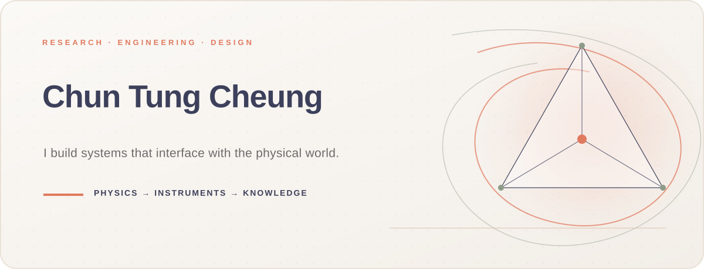
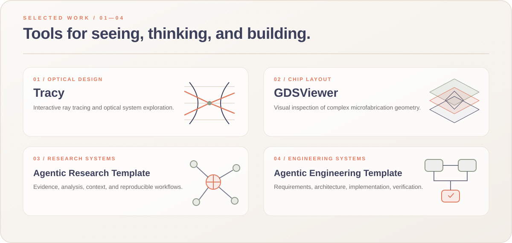

<picture>
  <source media="(prefers-color-scheme: dark)" srcset="./assets/hero-night.svg">
  <source media="(prefers-color-scheme: light)" srcset="./assets/hero-day.svg">
  
</picture>

 

## I build complex scientific systems.

I am a systems builder working where **physics, hardware, software, and automation become one system**. My work spans quantum technologies, optical engineering, RF and microwave engineering, data acquisition, signal processing, instrument control, and laboratory automation.

> **Physical Principle → Scientific Instrument → Trustworthy Knowledge**

I am currently completing a PhD in Physics at the University of Chicago, where I am developing an integrated quantum sensing platform for high-resolution microscale NMR spectroscopy at 14-Tesla (nearly half a million times Earth’s magnetic field strength).

## Selected Github Repo
These are a few of my public projects. More private projects will be released as I approach graduation in 2027!
 

<picture>
  <source media="(prefers-color-scheme: dark)" srcset="./assets/projects-night.svg">
  <source media="(prefers-color-scheme: light)" srcset="./assets/projects-day.svg">
  
</picture>

  <a href="https://github.com/cct1123/Tracy"><strong>Tracy ↗</strong></a>
  <a href="https://github.com/cct1123/gdsviewer"><strong>GDSViewer ↗</strong></a>
  <a href="https://github.com/cct1123/agentic-research-template"><strong>Research Template ↗</strong></a>
  <a href="https://github.com/cct1123/agentic-engineering-template"><strong>Engineering Template ↗</strong></a>

  <a href="https://github.com/cct1123?tab=repositories">Explore all repositories →</a>

 

## Engineering domains

`Experimental physics` · `Systems integration` · `Scientific instrumentation` · `Quantum sensing` · `Quantum computing` · `Nuclear magnetic resonance (NMR)` · `RF & microwave engineering` · `Optical engineering` · `Precision measurement` · `Data acquisition` · `Digital signal processing` · `Numerical simulation` · `Mathematical modeling` · `Scientific computing` · `Electromagnetic simulation` · `Semiconductor fabrication` · `Semiconductor process engineering` · `Diamond CVD` · `Lab-on-a-chip` · `Microfluidics` · `Laboratory automation` · `Software development` · `GUI development` · `Agentic workflows` · `Python`

 

---

  <strong>RESEARCH · ENGINEERING · DESIGN</strong>
    
  Building tools and instruments for exploring the physical world.
    
  <a href="https://ctcheung.studio">Website</a>
  &nbsp;·&nbsp;
  <a href="https://github.com/cct1123?tab=repositories">Repositories</a>
  &nbsp;·&nbsp;
  <a href="https://github.com/cct1123">Follow</a>

